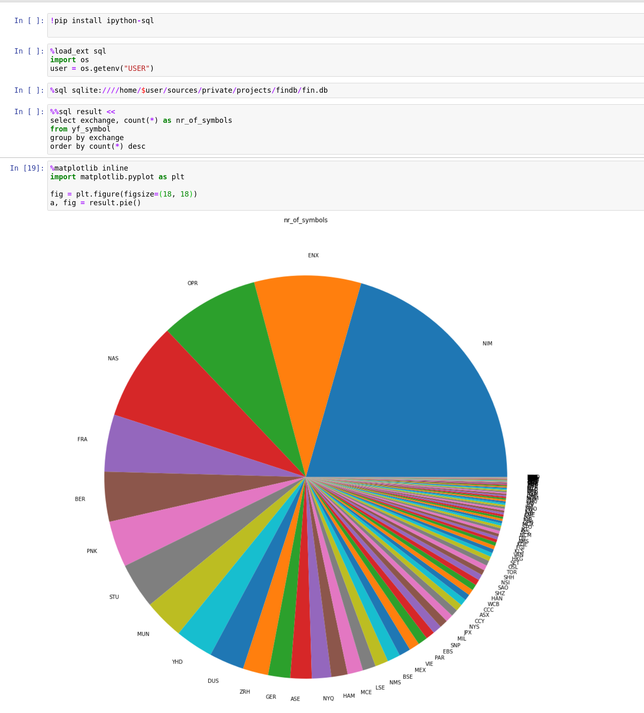

# Financial Research Data Base

The purpose of this database is to __enable research__. 

There is not much free available financial to support a research driven project. On the other hand a lot of APIs exist 
to obtain information of any individual asset. What is clearly missing is a broader access to the data in contrast to 
very specific API calls. To perform a research task the tool of choice is SQL. 

FinDB should enable individuals todo research without having to build their own individual database. Because this is not 
only tedious but also hits the same servers unnecessarily often for the same data. Save the planet! This is an attempt 
to introduce an open and crowed maintained database which can be used to do research across different assets classes, 
countries and sectors. In case you miss some specific data please consider contributing to this project. Make sure every
contribution includes a GitHub action as well to keep the data updated (see *Data Lifecycle and Frequency*).


## Project State
At the moment the data is focussed around static data to answer questions like:
* how are different asset classes distributed across different countries
* which assets should be part of a model (and are supported by my broker)

Later it may be useful to add price data as well such that questions like these can be answered:
* how did certain asset classes or sectors behave in periods like crashes
* how did those assets' covariance behave
* which factors can be used to building a factor model
* ...


## Data Lifecycle and Frequency
The purpose of this database is explicitly not to provide most recent up-to-date information. However, with the help of
GitHub actions the database will be growing on a regular basis with a rather low frequency like every month. This means
only new data will be added. Events like a company changing its industry or website or whatever will not be tracked.
Such events could be fixed with manual pull requests. Alternatively a full reset and start from scratch could be 
initiated. However, such a process would take several days and can not be done with GitHub actions. 


## ETL
Every database starts with an Extract Transform and Load process. As of now every data source will be extracted as a 
series of csv files. Then this csv files will be loaded into a sqlite database on a commit action. The database itself 
can be found as a [release asset](https://github.com/adagrad/findb/releases/tag/db). You should not use the csv files
directly as those files are just a medium of exchange and keep changing. To reproduce the database one would have to 
replay the commit history on those files.

Eventually one could load these files into a shared database hosted via [Dolthub](https://www.dolthub.com/). As of now
Dolthub has too many issues with performance, indices and data loading (can only load specific formatted csv files).


## Usage
The [sqlite](https://www.sqlite.org/index.html) database can be downloaded from 
[here](https://github.com/adagrad/findb/releases/tag/db) and used with basically any programing language. 

On Linux just 
```bash
wget https://github.com/adagrad/findb/releases/download/db/fin.db.tgz
```

Then execute queries directly using SQL tools like 
[DBeaver](https://github.com/dbeaver/dbeaver)
[](https://github.com/dbeaver/dbeaver)
or [SQLiteStudio](https://sqlitestudio.pl)
[](https://sqlitestudio.pl)

For those using MS Excel there are integrations for Excel as well, like 
[SQLiteForExcel](https://github.com/govert/SQLiteForExcel) for example.

Or just use [ipython-sql](https://pypi.org/project/ipython-sql/)
[](https://pypi.org/project/ipython-sql/)


## Contribution
Help with extending and maintenance is highly appreciated :-)
Contribute like you do with any other GitHub project by forking, and the submission of pull requests. Make sure you 
follow the ETL pattern. Use a github action to generate a data extraction preferable in csv format. Every action itself
commits the extracted data and pushes the changes back to the repository (and the full history remains).

Whenever a commit is made on the main branch (i.e. an action completes with a push, or a PR is merged), the new csv data 
will be loaded into the database automatically via github actions.

Until Dolthub has not fixed its various performance and loading issues remember the limits:
* GitHub only supports a maximum of 100 MB for each file and a maximum of 1 GB for each repository. 
* Each file under release assets can have a maximum of 2 GB, where the number of files is unlimited. 

There are also possible improvements on the database side as well, i.e. one could create views to match assets between 
different brokers or data sources.

## Credits
Inspired by [JerBouma/FinanceDatabase](https://github.com/JerBouma/FinanceDatabase/) but using GitHub actions to keep
data updated and use an SQL compliant database. No api client needed, just do SQL. 

A customized version of [Benny-/Yahoo-ticker-symbol-downloader](https://github.com/Benny-/Yahoo-ticker-symbol-downloader) 
is used to get the list of "all" symbols. [ranaroussi/yfinance](https://github.com/ranaroussi/yfinance) is used for the
sector and industry information. And a lot of custom and direct _requests_ calls.

